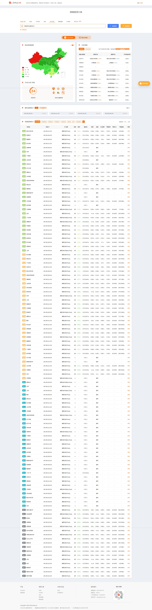

# 2026前主博客内容总结

本文整理了本博客在 **2026 年之前（2025 年）** 发布的全部文章内容，涵盖博客搭建教程、实用工具分享、软件发布与日常记录，共 10 篇。原文内容完整保留，按发布时间排序。

## 1. 新的开始！（2025-10-11）

> 博客上线公告：Mizuki 博客正式发布，介绍了未来的内容方向。

# 新的开始！我的 Mizuki 博客上线啦～

**我的博客将转到私人仓库，大家可以访问我的导航页**

::github{repo="halei0v0/halei0v0.github.io"}

Hello 大家好！终于在 2025 年 10 月，我的个人博客「Halei0v0's Mizuki Blog」正式和大家见面啦！这是我搭建的第一个独立博客，用 Mizuki 框架从 0 到 1 完成部署，现在已经稳定运行在 Vercel 和 Netlify 平台，域名是 v-blog.halei0v0.top，欢迎大家来访～

其实搭建博客的初衷很简单：想有一个属于自己的「数字小天地」，既能沉淀技术积累，也能记录生活里的细碎美好。之前一直用备忘录、记事本零散记录内容，时间久了不仅难找，还少了一份「分享」的乐趣。偶然发现 Mizuki 框架轻量又灵活，支持自定义配置还能快速部署，就抱着试试看的心态动手搭建，从配置环境、修改主题到部署上线，虽然过程中遇到过 Vercel 预览报错、样式调试不顺的小问题，但最终看到博客成功运行时，真的超级有成就感！

目前博客已经上线了几篇基础教程和工具分享，比如 Mizuki 博客搭建指南、文章撰写技巧，还有我常用的 Github 加速工具、无广告网络测速网站推荐。后续我会把这里打造成一个「技术 + 生活」的综合分享平台，主要围绕这几个方向更新：

### 1. 技术干货分享

作为一名喜欢折腾技术的开发者，会持续分享实用的技术内容：比如前端开发中的踩坑经验（JavaScript/TypeScript/React 相关）、Mizuki 博客进阶配置技巧、代码优化思路，还有各类开发工具的使用教程（从入门到进阶）。不管你是刚接触编程的新手，还是有一定经验的开发者，希望这些内容能帮到你少走弯路。

### 2. 实用软件 & 工具推荐

平时会收集很多提高效率的「宝藏工具」，之后会分类整理分享给大家：比如 Github 加速工具、无广告实用软件、办公效率神器、设计辅助工具等，每一款都会附上详细的使用场景和优缺点分析，帮大家避开「无效工具」，精准找到适合自己的好东西。

### 3. 程序相关资源 & 发布

如果后续开发了小型实用程序（比如批量处理工具、小脚本、简易工具类网站），会在这里同步发布，包括源码地址、使用说明和更新日志，感兴趣的朋友可以一起交流优化，也欢迎大家提出需求和建议～

### 4. 日常碎碎念 & 生活记录

除了技术和工具，也会分享一些生活里的日常：比如旅行中的所见所闻、喜欢的电影 / 书籍推荐、养猫日常（后续会更新更多「猫羽雫」的可爱照片～），还有偶尔的感悟和思考。希望这里不只是一个冰冷的技术博客，更能成为一个有温度、能和大家轻松交流的小空间。

博客刚起步，还有很多可以完善的地方，之后会慢慢优化页面样式、增加更多实用功能（比如评论区、分类标签细化）。如果大家在访问过程中遇到问题，或者有想看的内容、想了解的工具，都可以通过博客的联系方式告诉我～

最后，感谢每一位来访的朋友！愿我们都能在探索技术的路上不断进步，在生活里收获满满温柔。未来的日子，一起加油呀～ 🌟

（PS：博客支持 RSS 订阅，想及时获取更新的朋友可以订阅关注，后续也会陆续增加更多互动功能，敬请期待！）


---

## 2. 文章撰写教程（2025-10-18）

> 文章撰写完整教程：Markdown 语法、frontmatter 字段、加密文章等。

# 1.Markdown语法

## 什么是Markdown?(必看)

## [为什么要使用Markdown?](https://docs.mizuki.mysqil.com/press/md/#为什么要使用markdown)

使用传统的编辑方案，你得像个鼠标杂技演员，一会儿点粗体一会儿调字号，忙活半天像给文字铺地砖——累到想把键盘当枕头。但Markdown不一样，这货堪称"文字界的懒人福音"，就像发现外卖软件的厨房小白，从此告别格式挣扎，专注干饭...啊不，专注写作。

有人说这玩意叫"马可蛋"，因为学会它，你敲字的速度能赶上马在奔跑中下蛋的概率——听着离谱，但用过的人都知道：这概率居然挺高！

## [这货到底是个啥？](https://docs.mizuki.mysqil.com/press/md/#这货到底是个啥)

简单说，Markdown是一种让文字"自己打扮自己"的神奇咒语。2004年有个叫约翰·格鲁伯的老哥大概是受够了HTML的啰嗦，大手一挥发明了这东西——就像嫌系鞋带麻烦直接发明魔术贴一样天才。

它的脾气特别好：

- 用`#`号当帽子，文字就知道自己是标题；
- 给句子套个`*`号，它就乖乖斜着站；
- 想列清单？加个短横线，文字立马排好队站军姿。

最绝的是，就算你忘了给它"施法"，纯文本状态下的Markdown也长得眉清目秀，不像某些格式文件，换个软件打开就变成乱码抽象画。

## [凭啥它比Word香？](https://docs.mizuki.mysqil.com/press/md/#凭啥它比word香)

Word就像个堆满按钮的战斗机驾驶舱，想加粗文字得先找半天按钮；Markdown则是共享单车，扫码就走。

- **省脑子**：记住几个符号比背Office快捷键容易，就像记外卖电话比背菜谱简单；
- **不挑设备**：在手机上敲的.md文件，到电脑上打开照样整整齐齐，不像某些文档换个设备就"水土不服"；
- **变身达人**：想变HTML？变PDF？变Word？它都行，堪比文字界的变形金刚；
- **适合装X**：程序员看你用Markdown写文档会说"哥们儿懂行"，用Word则可能被吐槽"还在用记事本呢？"

## [哪些人该学这招？](https://docs.mizuki.mysqil.com/press/md/#哪些人该学这招)

- 写技术文档的码农：再也不用在代码里插一堆`<b>`标签，就像给汉堡包插牙签——多此一举；
- 记笔记的学生党：上课记重点时，用`##`标标题比画下划线快10倍，期末复习时再也不用对着乱涂的笔记本发呆；
- 发博客的博主：在知乎、简书敲文时，`**`加粗比找工具栏按钮爽，就像用语音输入代替手写；
- 摸鱼爱好者：格式搞定快，摸鱼时间多，懂的都懂。

## [Markdown学习资源](https://docs.mizuki.mysqil.com/press/md/#markdown学习资源)

📚 **推荐学习地址**：[菜鸟教程 - Markdown教程](https://www.runoob.com/markdown/md-tutorial.html)
（偷偷说：这教程简单到猫都能学会，前提是猫想学）

最后友情提示：学会Markdown不能让马真下蛋，但能让你从格式奴隶变成文字甩手掌柜。现在就打开记事本试试——# 我要当效率大师，怎么样，是不是有内味儿了？

# 2.文件

## 单文件方案

这是在Mizuka博客系统中创建文章的两种方法之一。这种方法适用于简单的文章，不需要管理大量图片资源的情况。 单文件方案会导致RSS无法正常构建图片的路径(指本地,如果你使用图床那么不会有这个问题),如果你需要使用rss功能请使用文件夹写作方案

## [创建文章](https://docs.mizuki.mysqil.com/press/file/#创建文章)

1. 在`src/content/posts`目录下创建一个新的Markdown文件，文件名应该具有描述性，例如`my-first-post.md`。
2. 在文件中添加frontmatter（前置元数据），这是文章的配置信息，必须包含`title`和`description`字段：


```markdown
---
title: Markdown Tutorial
published: 2025-01-20
pinned: true
description: A simple example of a Markdown blog post.
tags: [Markdown, Blogging]
category: Examples
licenseName: "Unlicensed"
author: emn178
sourceLink: "https://github.com/emn178/markdown"
draft: false
date: 2025-01-20
image:
  url: 'https://example.com/image.jpg'
  alt: '图片描述'
pubDate: 2025-01-20
---
```

## [Frontmatter字段详解](https://docs.mizuki.mysqil.com/press/file/#frontmatter字段详解)

frontmatter支持的字段包括：

### [必需字段](https://docs.mizuki.mysqil.com/press/file/#必需字段)

- `title`：文章标题（必需）
- `description`：文章描述（必需）

### [发布相关](https://docs.mizuki.mysqil.com/press/file/#发布相关)

- `published`：文章发布日期，格式为YYYY-MM-DD
- `pubDate`：文章发布日期（与published类似）
- `date`：文章创建日期
- `draft`：是否为草稿，true表示草稿，false表示正式发布

### [内容分类](https://docs.mizuki.mysqil.com/press/file/#内容分类)

- `tags`：文章标签数组，用于标记文章主题
- `category`：文章分类，用于组织文章
- `pinned`：是否置顶文章，true表示置顶

### [作者信息](https://docs.mizuki.mysqil.com/press/file/#作者信息)

- `author`：文章作者姓名
- `licenseName`：文章许可证名称，如"MIT"、"CC BY 4.0"等
- `sourceLink`：文章源链接，通常指向GitHub仓库或原始来源

### [图片设置](https://docs.mizuki.mysqil.com/press/file/#图片设置)

- ```
  image
  ```

  ：文章封面图片(单文件方案会导致RSS无法正常构建图片的路径,如果你需要使用rss功能请使用文件夹写作方案)

  - `url`：图片URL地址
  - `alt`：图片替代文本

1. 在frontmatter下方编写文章内容，可以使用标准的Markdown语法。

## [Markdown学习资源](https://docs.mizuki.mysqil.com/press/file/#markdown学习资源)

如果您还不熟悉Markdown语法，建议先学习基础知识：

📚 **推荐学习地址**：[菜鸟教程 - Markdown教程](https://www.runoob.com/markdown/md-tutorial.html)

这个教程涵盖了：

- Markdown基本语法
- 标题、段落、换行
- 字体样式（粗体、斜体等）
- 列表、链接、图片
- 代码块、表格
- 高级功能

掌握这些基础语法后，您就可以轻松编写美观的博客文章了！

## [Frontmatter最佳实践](https://docs.mizuki.mysqil.com/press/file/#frontmatter最佳实践)

### [日期格式](https://docs.mizuki.mysqil.com/press/file/#日期格式)

建议使用ISO 8601格式（YYYY-MM-DD）来设置日期：


```yaml
published: 2025-01-20
date: 2025-01-20
pubDate: 2025-01-20
```

### [标签和分类](https://docs.mizuki.mysqil.com/press/file/#标签和分类)

- 标签应该具体且相关，避免过于宽泛
- 分类用于高级组织，通常比标签更宽泛
- 示例：


```yaml
tags: [Vue.js, JavaScript, Frontend, Tutorial]
category: Web Development
```

### [草稿管理](https://docs.mizuki.mysqil.com/press/file/#草稿管理)

使用`draft`字段来管理文章状态：

- `draft: true` - 文章不会在生产环境中显示
- `draft: false` - 文章正常发布

### [许可证设置](https://docs.mizuki.mysqil.com/press/file/#许可证设置)

常见的许可证名称：

- "MIT"
- "Apache-2.0"
- "CC BY 4.0"
- "CC BY-SA 4.0"
- "Unlicensed"

### [完整示例](https://docs.mizuki.mysqil.com/press/file/#完整示例)


```markdown
---
title: "Vue.js 3 组合式API完全指南"
published: 2025-01-20
pinned: false
description: "深入了解Vue.js 3的组合式API，包括setup函数、响应式系统和生命周期钩子。"
tags: [Vue.js, JavaScript, Frontend, API]
category: "Web Development"
licenseName: "CC BY 4.0"
author: "张三"
sourceLink: "https://github.com/zhangsan/vue3-guide"
draft: false
date: 2025-01-20
image:
  url: 'https://example.com/vue3-cover.jpg'
  alt: 'Vue.js 3 组合式API指南封面'
pubDate: 2025-01-20
---

# Vue.js 3 组合式API完全指南

在这篇文章中，我们将深入探讨Vue.js 3的组合式API...
```

## [预览文章](https://docs.mizuki.mysqil.com/press/file/#预览文章)

保存文件后，可以在浏览器中预览文章。将文章文件名（不包括.md扩展名）拼接到预览URL的末尾即可查看。 例如，如果本地开发服务器运行在`http://localhost:4321/`，文章文件名为`my-first-post.md`，则可以通过`http://localhost:4321/posts/my-first-post`访问文章。

如果文章尚未创建或文件名错误，页面将显示404错误。当你预览一个尚未创建的文章时，控制台会显示不同的输出，这有助于进行故障排查。

## [链接到文章](https://docs.mizuki.mysqil.com/press/file/#链接到文章)

要在博客页面或其他页面中链接到你的文章，可以使用标准的HTML `<a>` 标签：


```html
<a href="/posts/my-first-post/">我的第一篇文章</a>
```

确保链接的href属性指向正确的文章路径。

## [添加图片](https://docs.mizuki.mysqil.com/press/file/#添加图片)

如果需要在文章中添加图片，可以将图片文件放在`public`目录下，然后在文章中通过相对路径引用：


```markdown

```

## [创建多篇文章](https://docs.mizuki.mysqil.com/press/file/#创建多篇文章)

你可以在`src/content/posts/`目录下创建多个Markdown文件，每个文件代表一篇文章。例如：


```
src/content/posts/
├── my-first-post.md
├── my-second-post.md
└── my-third-post.md
```

每篇文章都是一个独立的Markdown文件，文件名将被用作文章的URL路径。

## [链接多篇文章](https://docs.mizuki.mysqil.com/press/file/#链接多篇文章)

要在博客页面中链接到多篇文章，可以创建一个文章列表：


```html
<ul>
  <li><a href="/posts/my-first-post/">我的第一篇文章</a></li>
  <li><a href="/posts/my-second-post/">我的第二篇文章</a></li>
  <li><a href="/posts/my-third-post/">我的第三篇文章</a></li>
</ul>
```

确保每个链接都指向正确的文章路径。

## [注意事项](https://docs.mizuki.mysqil.com/press/file/#注意事项)

- 文件名将被用作文章的URL路径，所以应该具有描述性且不含特殊字符
- frontmatter中的`date`字段是可选的，如果不提供，系统会使用文件的创建日期
- 这种方法适合简单的文章，但如果文章包含大量图片，建议使用子文件夹方案

# 3.文件夹

## 文件夹方案（推荐）

这是在Mizuka博客系统中创建文章的推荐方法。这种方法更适合复杂的文章，特别是包含大量图片或其他资源的文章。

## [创建文章](https://docs.mizuki.mysqil.com/press/folder/#创建文章)

1. 在`src/content/posts`目录下创建一个新的文件夹，文件夹名应该具有描述性，例如`my-complex-post`。
2. 在新创建的文件夹中创建一个名为`index.md`的文件。
3. 在`index.md`文件中添加frontmatter（前置元数据），这是文章的配置信息，必须包含`title`和`description`字段：


```markdown
---
title: Markdown Tutorial
published: 2025-01-20
pinned: true
description: A simple example of a Markdown blog post.
tags: [Markdown, Blogging]
category: Examples
licenseName: "Unlicensed"
author: emn178
sourceLink: "https://github.com/emn178/markdown"
draft: false
date: 2025-01-20
image:
  url: './cover.jpg'
  alt: '文章封面'
pubDate: 2025-01-20
---
```

## [Frontmatter字段详解](https://docs.mizuki.mysqil.com/press/folder/#frontmatter字段详解)

frontmatter支持的字段包括：

### [必需字段](https://docs.mizuki.mysqil.com/press/folder/#必需字段)

- `title`：文章标题（必需）
- `description`：文章描述（必需）

### [发布相关](https://docs.mizuki.mysqil.com/press/folder/#发布相关)

- `published`：文章发布日期，格式为YYYY-MM-DD
- `pubDate`：文章发布日期（与published类似）
- `date`：文章创建日期
- `draft`：是否为草稿，true表示草稿，false表示正式发布

### [内容分类](https://docs.mizuki.mysqil.com/press/folder/#内容分类)

- `tags`：文章标签数组，用于标记文章主题
- `category`：文章分类，用于组织文章
- `pinned`：是否置顶文章，true表示置顶

### [作者信息](https://docs.mizuki.mysqil.com/press/folder/#作者信息)

- `author`：文章作者姓名
- `licenseName`：文章许可证名称，如"MIT"、"CC BY 4.0"等
- `sourceLink`：文章源链接，通常指向GitHub仓库或原始来源

### [图片设置](https://docs.mizuki.mysqil.com/press/folder/#图片设置)

- ```
  image
  ```

  ：文章封面图片

  - `url`：图片URL地址（可以是相对路径如'./cover.jpg'）
  - `alt`：图片替代文本

1. 在frontmatter下方编写文章内容，可以使用标准的Markdown语法。

## [Markdown学习资源](https://docs.mizuki.mysqil.com/press/folder/#markdown学习资源)

如果您还不熟悉Markdown语法，建议先学习基础知识：

📚 **推荐学习地址**：[菜鸟教程 - Markdown教程](https://www.runoob.com/markdown/md-tutorial.html)

这个教程涵盖了：

- Markdown基本语法
- 标题、段落、换行
- 字体样式（粗体、斜体等）
- 列表、链接、图片
- 代码块、表格
- 高级功能

掌握这些基础语法后，您就可以轻松编写美观的博客文章了！

## [Frontmatter最佳实践](https://docs.mizuki.mysqil.com/press/folder/#frontmatter最佳实践)

### [日期格式](https://docs.mizuki.mysqil.com/press/folder/#日期格式)

建议使用ISO 8601格式（YYYY-MM-DD）来设置日期：


```yaml
published: 2025-01-20
date: 2025-01-20
pubDate: 2025-01-20
```

### [标签和分类](https://docs.mizuki.mysqil.com/press/folder/#标签和分类)

- 标签应该具体且相关，避免过于宽泛
- 分类用于高级组织，通常比标签更宽泛
- 示例：


```yaml
tags: [Vue.js, JavaScript, Frontend, Tutorial]
category: Web Development
```

### [草稿管理](https://docs.mizuki.mysqil.com/press/folder/#草稿管理)

使用`draft`字段来管理文章状态：

- `draft: true` - 文章不会在生产环境中显示
- `draft: false` - 文章正常发布

### [许可证设置](https://docs.mizuki.mysqil.com/press/folder/#许可证设置)

常见的许可证名称：

- "MIT"
- "Apache-2.0"
- "CC BY 4.0"
- "CC BY-SA 4.0"
- "Unlicensed"

### [图片路径最佳实践](https://docs.mizuki.mysqil.com/press/folder/#图片路径最佳实践)

在子文件夹方法中，推荐使用相对路径引用图片：


```yaml
image:
  url: './cover.jpg'  # 相对于当前文件夹
  alt: '文章封面图片描述'
```

### [完整示例](https://docs.mizuki.mysqil.com/press/folder/#完整示例)


```markdown
---
title: "React Hooks深度解析"
published: 2025-01-20
pinned: true
description: "全面解析React Hooks的使用方法和最佳实践，包含大量代码示例和图片说明。"
tags: [React, JavaScript, Hooks, Frontend]
category: "Web Development"
licenseName: "MIT"
author: "李四"
sourceLink: "https://github.com/lisi/react-hooks-guide"
draft: false
date: 2025-01-20
image:
  url: './react-hooks-cover.png'
  alt: 'React Hooks深度解析封面'
pubDate: 2025-01-20
---

# React Hooks深度解析


在这篇文章中，我们将深入探讨React Hooks...
```

## [预览文章](https://docs.mizuki.mysqil.com/press/folder/#预览文章)

保存文件后，可以在浏览器中预览文章。将文件夹名拼接到预览URL的末尾即可查看。 例如，如果本地开发服务器运行在`http://localhost:4321/`，文件夹名为`my-complex-post`，则可以通过`http://localhost:4321/posts/my-complex-post`访问文章。

如果文章尚未创建或文件夹名错误，页面将显示404错误。当你预览一个尚未创建的文章时，控制台会显示不同的输出，这有助于进行故障排查。

## [链接到文章](https://docs.mizuki.mysqil.com/press/folder/#链接到文章)

要在博客页面或其他页面中链接到你的文章，可以使用标准的HTML `<a>` 标签：


```html
<a href="/posts/my-complex-post/">我的复杂文章</a>
```

确保链接的href属性指向正确的文章路径。

## [管理图片和其他资源](https://docs.mizuki.mysqil.com/press/folder/#管理图片和其他资源)

使用这种方法，你可以将文章相关的所有资源都放在同一个文件夹中，便于管理：


```
src/content/posts/my-complex-post/
├── index.md
├── image1.png
├── image2.jpg
└── data.json
```

在文章中引用图片时，可以直接使用相对路径：


```markdown

```

注意像这样直接填写文件的名字,这样才能让RSS正常构建图片的路径

## [创建多篇文章](https://docs.mizuki.mysqil.com/press/folder/#创建多篇文章)

你可以在`src/content/posts/`目录下创建多个文件夹，每个文件夹代表一篇文章。例如：


```
src/content/posts/
├── my-first-post/
│   ├── index.md
│   └── cover.jpg
├── my-second-post/
│   ├── index.md
│   ├── image1.png
│   └── image2.png
└── my-third-post/
    ├── index.md
    └── data.json
```

每篇文章都有自己的独立文件夹，便于管理和维护。

## [链接多篇文章](https://docs.mizuki.mysqil.com/press/folder/#链接多篇文章)

要在博客页面中链接到多篇文章，可以创建一个文章列表：


```html
<ul>
  <li><a href="/posts/my-first-post/">我的第一篇文章</a></li>
  <li><a href="/posts/my-second-post/">我的第二篇文章</a></li>
  <li><a href="/posts/my-third-post/">我的第三篇文章</a></li>
</ul>
```

确保每个链接都指向正确的文章路径。

## [优势](https://docs.mizuki.mysqil.com/press/folder/#优势)

- 所有文章资源集中管理，便于维护
- 图片引用更简单，使用相对路径即可
- 更好的组织结构，特别是对于包含大量资源的文章
- 便于文章的迁移和备份
- 每篇文章都有独立的文件夹，避免资源混淆

# 4.文章加密（可选）

## 文章客户端加密

## [概述](https://docs.mizuki.mysqil.com/press/key/#概述)

主题使用了 `bcryptjs` 用于密码的哈希处理，以及 `crypto-js` 用于内容的对称加密。

## [工作流程](https://docs.mizuki.mysqil.com/press/key/#工作流程)

这一阶段发生在访客的浏览器里，当他们访问那个被加密的页面时：

### [1. 用户交互](https://docs.mizuki.mysqil.com/press/key/#_1-用户交互)

访客首先看到的不是文章，而是一个密码输入界面。

### [2. 客户端验证与解密](https://docs.mizuki.mysqil.com/press/key/#_2-客户端验证与解密)

当访客输入密码并点击"解锁"后，页面内嵌的 JavaScript 脚本会执行以下操作：

#### [验证密码](https://docs.mizuki.mysqil.com/press/key/#验证密码)

脚本会先用 `bcryptjs` 将访客输入的密码进行同样的哈希计算，然后与页面中预存的那个哈希值进行比对。如果二者匹配，证明密码正确。这是为了快速验证密码，避免用错误的密码去尝试解密，浪费计算资源。

#### [解密内容](https://docs.mizuki.mysqil.com/press/key/#解密内容)

密码验证通过后，脚本会使用访客刚刚输入的明文密码（它只存在于浏览器内存中，不会被发送到任何地方）作为密钥，调用 `crypto-js` 来解密页面中存储的文章密文。

#### [动态渲染](https://docs.mizuki.mysqil.com/press/key/#动态渲染)

一旦密文被成功解密，脚本就会将还原出的、包含完整格式的 HTML 内容，动态地插入到页面的相应容器中。

### [3. 完成展示](https://docs.mizuki.mysqil.com/press/key/#_3-完成展示)

至此，访客才能看到文章的真实内容。通过这种方式，我们成功地在没有后端的情况下，模拟出了一套安全的"验证-解密-渲染"流程，实现了对静态内容的有效保护。

## [使用方法](https://docs.mizuki.mysqil.com/press/key/#使用方法)

在文章的 Front Matter 中添加以下配置：


```markdown
---
title: '这是一篇加密文章'
encrypted: true
password: 'your-secret-password'
---
```

这样定义后就可以实现为文章设定不可逆的文章加密，只有输入正确的密码才能查看文章内容。

# 5.图表

## Mermaid图表

我们可以使用mermaid语法来在文章中绘制图表

```
    ```mermaid
    graph TD
        A[Start] --> B{Condition Check}
        B -->|Yes| C[Process Step 1]
        B -->|No| D[Process Step 2]
        C --> E[Subprocess]
        D --> E
        subgraph E [Subprocess Details]
            E1[Substep 1] --> E2[Substep 2]
            E2 --> E3[Substep 3]
        end
        E --> F{Another Decision}
        F -->|Option 1| G[Result 1]
        F -->|Option 2| H[Result 2]
        F -->|Option 3| I[Result 3]
        G --> J[End]
        H --> J
        I --> J
```
# 以下是图片测试

**Github**图床图片


**本地直接显示的图片**

.png)

.png)


---

## 3. Mizuki博客使用技巧（2025-10-19）

> Mizuki 博客使用技巧：特殊标签与特色功能页面介绍。

# 一.特殊标签

```
:::note
Highlights information that users should take into account, even when skimming.
:::
```

:::note
Highlights information that users should take into account, even when skimming.
:::


```
:::tip
Optional information to help a user be more successful.
:::
```

:::tip
Optional information to help a user be more successful.
:::


```
:::important
Crucial information necessary for users to succeed.
:::
```

:::important
Crucial information necessary for users to succeed.
:::


```
:::warning
Critical content demanding immediate user attention due to potential risks.
:::
```

:::warning
Critical content demanding immediate user attention due to potential risks.
:::


```
:::caution
Negative potential consequences of an action.
:::
```

:::caution
Negative potential consequences of an action.
:::

# 二.特色功能

1. [自定义页面 ](https://docs.mizuki.mysqil.com/special/about/)

2. [日记页面 ](https://docs.mizuki.mysqil.com/special/diary/)

3. [友链页面](https://docs.mizuki.mysqil.com/special/friends/)

4. [番剧页面 ](https://docs.mizuki.mysqil.com/special/anime/)

5. [相册页面 ](https://docs.mizuki.mysqil.com/special/gallery/)

6. [其他页面 ](https://docs.mizuki.mysqil.com/special/other/)


---

## 4. 域名测速网站（2025-10-20）

> 域名测速网站推荐：zhale.me 多节点测速工具。

测速工具（节点很多，非常推荐）：https://zhale.me/http/

:::note

可见Github Pages国内访问是有多“迅速”竟拿下了`34`的“高分”

后续改进吧，毕竟Github Pages是相对来讲不折腾的了【没办法的等一下也就加载出来了；有办法的↑🧱↓】

O(∩_∩)O毕竟正常看个文章没问题是吧~

:::




---

## 5. 网络工具（2025-10-21）

> 网络工具合集：机场订阅链接与客户端软件（原文为加密文章）。

# 前言

## 机场工具，谨慎使用！！


# 订阅链接

[点击进入](https://webnote.cc/p/4bc0a70f62dafdd1)：https://webnote.cc/p/4bc0a70f62dafdd1

# 备份

永久无限订阅1，此订阅链接被墙，暂无法订阅
https://5f236t3.flownets.xyz/s/3fbf8d32b490dc9d160c7a1b3c583c0c

永久无限订阅2，此订阅链接被墙，暂无法订阅
https://shb.tyreo.cn/api/v1/client/subscribe?token=0b04a6288fdc7513c8d5b1295e971fb8

永久无限订阅3，此订阅链接被墙，需要挂节点更新
https://shb.tyreo.cn/max/ng?token=0b04a6288fdc7513c8d5b1295e971fb8

永久无限订阅4，可正常使用
https://sub.lbw666.ggff.net/sub?token=561a83eccfb35b1e15398c22a94456be

# 软件下载

**Windows**：

[clash-verge](https://www.clash-verge.com.cn/)：https://www.clash-verge.com.cn/

[官方Github仓库下载：](https://github.com/clash-verge-rev/clash-verge-rev/releases/)https://github.com/clash-verge-rev/clash-verge-rev/releases/

**Android**：

nekobox下载
https://lzznb.lanzouu.com/i0DN730239ve

nekobox使用教程
https://iclash.pro/nekobox-for-android-news/


---

## 6. 对Mizuki的一些看法（2025-10-25）

> 对 Mizuki 6.1pro 的一些看法与吐槽。

# 前言

> 最近修改博客多多少少遇到一些问题但总体上无大碍
>
> 但是为什么Mizuki作者要在我好不容易从5.1更新到5.3的情况下推出6.1pro？？
>
> 很无语好吗啊喂(#`O′)！！

# Mizuki博客6.1pro

* **页面重构**：完全重构动漫、时间线、项目、技能、相册、朋友、日记和关于页面，以获得更好的性能和用户体验。
* **页面切换功能**：添加了带有 SEO 优化模块的页面切换功能，允许控制功能页面可见性。
* **新的网格布局**：引入了新的网格文章列表布局，以改进内容呈现。
* **涟漪管理**：添加了涟漪效应管理模块以增强视觉交互。
* **简单图标支持**：添加了对简单图标的支持，可以访问更丰富的图标库以进行界面自定义。
* **移动文章列表布局**：推出专为移动设备优化的全新文章列表布局，提高了小屏幕上的可读性和作便利性。
* **RSS 和 ATOM**：优化 RSS 和 ATOM 的移动布局。

> 不过我觉得重构以后的文章列表好像不怎么好看，要更新有空再折腾吧，最近有点累了😔，大家有时间可以去试试~


# Mizuki模板下载地址

::github{repo="matsuzaka-yuki/Mizuki"}

V 6.1:[Release Mizuki v6.1 Pro ](https://github.com/matsuzaka-yuki/Mizuki/releases/tag/6.0)

:::note

觉得6.1不好看的可以和我一起用5.3，其他版本多少问题都有点大，(●ˇ∀ˇ●)——踩过坑的我┭┮﹏┭┮

:::


---

## 7. Fast Github【Github加速工具】（2025-10-31）

> Fast GitHub 加速工具：解决 GitHub 访问卡顿问题。

# 软件介绍

github加速神器，解决github打不开、用户头像无法加载、releases无法上传下载、git-clone、git-pull、git-push失败等问题。

### 1. 程序下载

::github{repo="creazyboyone/FastGithub"}

- [github-release](https://github.com/creazyboyone/FastGithub)

- [网盘下载](https://pan.huang1111.cn/s/P6bO6hm)

  :::note

  [网盘下载](https://pan.huang1111.cn/s/P6bO6hm)为了方便无法直接访问GitHub的用户下载，无需登录可直接下载~~

  :::

### 2. 部署方式

#### 2.1 windows-x64桌面

- 双击运行FastGithub.UI.exe

#### 2.2 windows-x64服务

- `fastgithub.exe start` // 以windows服务安装并启动
- `fastgithub.exe stop` // 以windows服务卸载并删除

#### 2.3 linux-x64终端

- `sudo ./fastgithub`
- 设置系统自动代理为`http://127.0.0.1:38457`，或手动代理http/https为`127.0.0.1:38457`

#### 2.4 linux-x64服务

- `sudo ./fastgithub start` // 以systemd服务安装并启动
- `sudo ./fastgithub stop` // 以systemd服务卸载并删除
- 设置系统自动代理为`http://127.0.0.1:38457`，或手动代理http/https为`127.0.0.1:38457`

#### 2.5 macOS-x64

- 双击运行fastgithub
- 安装cacert/fastgithub.cer并设置信任
- 设置系统自动代理为`http://127.0.0.1:38457`，或手动代理http/https为`127.0.0.1:38457`
- [具体配置详情](https://github.com/creazyboyone/FastGithub/blob/master/MacOSXConfig.md)

#### 2.6 docker-compose一键部署

- 准备好docker 18.09, docker-compose.
- 在源码目录下，有一个docker-compose.yaml 文件，专用于在实际项目中，临时使用github.com源码，而做的demo配置。
- 根据自己的需要更新docker-compose.yaml中的sample和build镜像即可完成拉github.com源码加速，并基于源码做后续的操作。

### 3. 软件功能

- 提供域名的纯净IP解析；
- 提供IP测速并选择最快的IP；
- 提供域名的tls连接自定义配置；
- google的CDN资源替换，解决大量国外网站无法加载js和css的问题；

### 4. 证书验证

#### 4.1 git

git操作提示`SSL certificate problem`
需要关闭git的证书验证：`git config --global http.sslverify false`

#### 4.2 firefox

firefox提示`连接有潜在的安全问题`
设置->隐私与安全->证书->查看证书->证书颁发机构，导入cacert/fastgithub.cer，勾选“信任由此证书颁发机构来标识网站”

### 5. 安全性说明

FastGithub为每台不同的主机生成自颁发CA证书，保存在cacert文件夹下。客户端设备需要安装和无条件信任自颁发的CA证书，请不要将证书私钥泄露给他人，以免造成损失。

### 6. 合法性说明

《国际联网暂行规定》第六条规定：“计算机信息网络直接进行国际联网，必须使用邮电部国家公用电信网提供的国际出入口信道。任何单位和个人不得自行建立或者使用其他信道进行国际联网。” FastGithub本地代理使用的都是“公用电信网提供的国际出入口信道”，从国外Github服务器到国内用户电脑上FastGithub程序的流量，使用的是正常流量通道，其间未对流量进行任何额外加密（仅有网页原有的TLS加密，区别于VPN的流量加密），而FastGithub获取到网页数据之后发生的整个代理过程完全在国内，不再适用国际互联网相关之规定。


# 注意事项

:::note

此软件无法正常登录Cloud flare！

请不要在使用此软件时登录Cloud flare！

:::

## 什么是 Fast GitHub？

Fast GitHub 是一个专为开发者设计的开源工具，旨在解决在中国大陆及其他网络环境不佳地区访问 GitHub 时遇到的**速度慢**、**连接不稳定**、**克隆仓库失败**等问题。通过智能 DNS 解析和流量优化技术，它能够显著提升 GitHub 及相关服务的访问速度。

## 为什么需要 Fast GitHub？

### 常见的访问问题

- **仓库克隆缓慢**：特别是大型仓库，经常中断
- **页面加载时间长**：GitHub 网页界面响应缓慢
- **Raw 文件下载失败**：无法正常下载仓库中的原始文件
- **API 调用限制**：由于网络问题导致的 API 调用失败

### 传统解决方案的不足

- VPN/代理配置复杂
- 修改 hosts 文件需要手动维护
- 某些企业环境禁止使用代理

## Fast GitHub 的工作原理

### 核心技术

1. **智能 DNS 解析**
   - 自动检测最优的 GitHub 服务器 IP
   - 绕过污染 DNS，使用干净的解析结果
2. **本地代理服务**
   - 在本地建立代理服务器
   - 对 GitHub 相关流量进行专门优化
3. **流量劫持与重定向**
   - 透明劫持对 GitHub 域名的请求
   - 自动重定向到优化路径

## 功能特性

### 🚀 极速体验

- GitHub 网页加载速度提升 5-10 倍
- 仓库克隆速度显著改善
- 图片、资源文件加载无延迟

### 🔒 安全可靠

- 开源透明，无后门风险
- 不收集用户数据
- 仅针对 GitHub 相关域名进行优化

### ⚡ 简单易用

- 一键安装，开箱即用
- 自动配置，无需复杂设置
- 支持所有主流操作系统

### 🔄 持续更新

- 自动更新最优 IP 列表
- 及时适应 GitHub 架构变化
- 活跃的社区维护

## 使用注意事项

### 网络环境适配

- 在企业网络中使用前请获得管理员同意
- 某些严格管控的网络环境可能无法使用

### 安全性考虑

- 虽然工具本身安全，但建议从官方渠道下载
- 定期更新到最新版本

### 与其他工具的兼容性

- 可能与某些 VPN 冲突
- 如遇问题，可暂时停用排查

## 替代方案对比

| 工具方案    | 易用性 | 效果  | 安全性 | 成本      |
| :---------- | :----- | :---- | :----- | :-------- |
| Fast GitHub | ⭐⭐⭐⭐⭐  | ⭐⭐⭐⭐⭐ | ⭐⭐⭐⭐   | 免费      |
| 修改 hosts  | ⭐⭐     | ⭐⭐⭐   | ⭐⭐⭐⭐   | 免费      |
| 商业 VPN    | ⭐⭐⭐    | ⭐⭐⭐⭐  | ⭐⭐⭐    | 付费      |
| 代理软件    | ⭐⭐     | ⭐⭐⭐⭐  | ⭐⭐     | 免费/付费 |

## 总结

Fast GitHub 是解决 GitHub 访问问题的**高效、安全、免费**的解决方案。无论你是学生、开发者还是企业用户，都能从中受益。通过简单的安装配置，即可享受流畅的 GitHub 使用体验，大大提升开发效率。

**立即尝试 Fast GitHub，告别漫长的等待，让代码管理变得更加高效愉悦！**

------

*温馨提示：使用任何网络工具时，请遵守当地法律法规和网络使用政策。*


---

## 8. 旧博客文章汇总（2025-12-06）

> 旧博客（Gmeek）内容汇总：AI 部署、博客搭建、工具与日常合集。

# 技术、工具、日常及博客相关汇总

:::note

旧博客地址：halei0v0.github.io/blog

:::

::github{repo="halei0v0/blog"}

# 技术、工具、日常及博客相关合集

## 【AI——deepseek】deepseek 本地部署教程！

软件使用 ollama，适配 Windows 系统，需机架式服务器硬件支持，如浪潮 SA5212M5 双路 2U 服务器、Intel 至强 Platinum 8259CL CPU、DDR4 ECC 服务器内存等，硬件需解锁功耗墙，可参考指定 B 站视频及百度网盘刷机包。部署时先下载 ollama 并通过命令行下载 deepseek 模型（支持 671b、70b 等多版本切换），再下载 Chatbox，选择本地模型关联 ollama API 即可使用。

## 【AI——Ollama】Ollama 部署本地模型！

Ollama 是开源本地 LLM 部署工具，支持 macOS、Linux 系统，可保障数据隐私，提供模型微调接口。安装时可自定义路径（如 D 盘），通过命令行配置环境变量并安装程序，从官网获取模型下载命令后，在 CMD 中执行即可完成部署。运行模型可通过命令行或 Chatbox UI 界面，支持模型版本灵活切换，还可通过设置更改模型部署路径。

## 【博客搭建】0 成本搭建一个简单不费事的个人博客！

基于 Github Pages 实现 0 成本搭建，无需复杂基础，5 分钟即可完成。注册 Github 账号后，通过 Gmeek 模板创建指定名称仓库（用户名.github.io 格式可获免费域名），配置 Pages 和 Github Actions，通过 Issues 撰写 Markdown 格式文章并选择标签。可修改 config.json 文件自定义博客标题、简介和头像，首次搭建或修改基础信息后需在 Actions 中运行 build Gmeek。支持添加访问计数、目录等进阶功能，国内访问需注意延迟问题。

## 【博客搭建】Hexo 博客搭建～

需先下载 nodejs 和 git 工具，通过命令行安装 Hexo 并初始化本地博客。在 Github 创建指定名称仓库，生成并配置 SSH 密钥，修改博客文件夹中_config.yml 文件的部署信息，安装自动部署工具后即可上传博客至 Github。支持自定义网站标题、副标题等基础信息，通过 Hexo 命令新建和上传文章，推荐使用 Typora 编辑，可更换 Butterfly、anzhiyu 等主题。

## 【博客指南】数码篇～～

技术类博客需平衡硬核与易懂，选题可涵盖教程、工具评测等，搭配生活场景类比和代码示例；游戏类博客侧重沉浸感与互动性，融入场景描述、数据支撑和玩家社群流行语；数码类博客需保持客观，结合参数与实际体验，可加入拆解、DIY 内容。跨领域通用技巧包括蹭热点与长效内容结合、SEO 优化和多元变现路径，同时需注意避免术语堆砌、谨慎剧透等避坑点。

## 【福利】不定期更新哦！

提供游戏福利下载渠道，推荐通过 KOYSO 网站获取，下载时建议用 Motrix 工具提升速度。进入网站需开启广告拦截工具，仔细辨别不良信息，所有资源自愿使用，与 UP 主无关。

## 【工具】Google 学习工具～～

分享 Sheas Cealer 工具，基于 WPF (.Net8) 开发，适用于 Windows 系统，可用于抵御网络非法监听和网络安全研究。工具内置伪造规则持续更新，支持 Setup 安装和 Zip 免安装两种方式，使用前需阅读用户协议。提供 Github 和群文件下载渠道，相关原理、食用文档和联系方式可通过指定链接查询。

## 【工具】VIP 电影视频？都不是事儿～

推荐虾米解析工具，支持优酷、爱奇艺等多平台 VIP 视频解析，无需购买 VIP 即可观看。工具地址为https://jx.xmflv.cc/，若遇到无对话框输入的情况，可将网址 “=” 后的字符替换为目标视频链接。仅用于学习交流，禁止非法用途。

## 【工具篇】番茄小说 txt 下载工具～～

这款工具支持获取番茄小说并下载为 TXT 或 EPUB 格式，具备图形界面与命令行双形态，支持整本或按范围下载，自动处理封面与元数据，多线程下载且失败可自动重试。工具已解决 API 验证问题，可通过 Github 链接下载使用。

## 【工具篇】免费串流工具～CloudPlay Plus

来自 B 站 UP 主自制的免费串流工具，官网为[cloudplayplus.com](https://cloudplayplus.com/)，可实现电脑远程操控管理、远程办公及游戏。工具延迟较大，建议选用游戏模式或自行搭建中继服务器优化使用体验。

## 【工具篇】轻松不卡顿玩转 Github！（GitHub 加速工具 Fastgithub）

这款 Github 加速工具可解决访问卡顿问题，提供项目地址和 Windows 版本下载链接，下载后即可使用，无需复杂配置。

## 【技术】C 盘爆满？一个软件搞定！

针对 C 盘爆满问题，推荐使用 DiskGenius 工具进行扩容，可在系统中直接使用或进入微 PE 系统操作（微 PE 自带该工具）。扩容需在同一磁盘下进行，机械硬盘需先检查坏道，操作前务必备份重要数据。

## 【技术分享】AI 桌宠聊天软件～～

开源轻量级 AI 桌宠软件支持本地云端混合推理，分钟级部署，最低需 3.22GB 存储空间和 6GB 显存，小白易上手。提供 Github、官网等下载和部署相关链接，可参考指定 B 站视频教程完成配置。

## 【开始】Hello 2025！

UP 主哈雷 0V0（又名 02halei）记录于 2025 年新春，分享了博客搭建的经历，提及之前尝试 hexo 和 hux 搭建方式不尽人意，后通过简单项目实现搭建需求。后续将分享包括博客搭建教程在内的内容，鼓励大家尝试免费资源。

## 【科技新闻】 砺算科技第一代 TrueGPU 系列图形卡发布，国产真自研高性能图形 GPU 来了！（有待考证，暂无 up 实测数据）

7 月 26 日砺算科技发布首款 GPU 芯片 7G100 系列及 Lisuan eXtreme 系列显卡，基于自研 TrueGPU 天图架构，具备智能多任务处理、乱序渲染等优势，实测在游戏和专业应用中表现良好，支持 DeepSeek 等大模型需求。显卡包含消费级和专业级，预计 2025 年 8 月送样、9 月量产。UP 主支持国产显卡发展，但提醒兼容性和实测数据有待验证。

## 【日常】《红楼梦》21~40 回目总结。

逐回总结《红楼梦》21 至 40 回的起因、经过和结果，涵盖宝黛钗情感纠葛、贾府日常琐事、重要情节转折等内容，如黛玉葬花、宝玉挨打、海棠社成立等，脉络清晰，便于梳理剧情。

## 【日常】Github 好烦！

UP 主吐槽前段时间 Github 使用不顺，导致文章无法正常撰写，正在尝试新博客搭建，询问 claw cloud 中 wordpress 更改域名后数据库同步修改的方法。

## 【日常】博客心得～～

UP 主表示写博客初衷是当作日记，同时也希望能被他人看到，但目前暂无读者关注。

## 【日常】关于三角洲外挂的一些看法～

UP 主分享对《三角洲》游戏外挂的看法，介绍了 DMA 外挂的原理和反作弊系统的局限性，指出外挂无法完全根除。同时吐槽该游戏反作弊扫盘伤硬盘、误封严重，制作组不重视玩家感受，建议非核心爱好者退游。

## 【日常】哈哈太好玩了 “《双影奇境》”（附下载链接）

推荐双人合作冒险游戏《双影奇境》，该游戏于 2025 年 3 月发售，支持多平台及跨平台联机，玩家可通过好友通行证邀请好友免费游玩，曾获三项吉尼斯世界纪录。提供游戏下载链接，点击即可获取。

## 【软件 —— 灵动桌面】免费平替 Wallpaper Engine！

推荐免费动态壁纸软件灵动桌面，可作为 Wallpaper Engine 的平替，提供 B 站视频参考链接和官网地址[wallpaperplay.cn](https://wallpaperplay.cn/)，无需付费即可使用动态壁纸功能。

## 【特讯】EPIC 送僵尸世界大战啦！！2025.2.21

通知 EPIC 平台限时一周赠送《僵尸世界大战》游戏，UP 主已入库，呼吁大家及时领取。

## 【通知】Blog 最新相关问题～

因 Github 暂停 Ubuntu20.4 支持，导致博客 Actions 无法正常运行，解决方案为修改.github/workflows 文件夹下 Gmeek.yml 文件，将第 13 行和第 74 行改为 runs-on: ubuntu-24.04，保存后手动全局生成即可。

## 【通知】博客好像出问题了。。

原博客因 GitHub issues 文章丢失无法正常运作，UP 主已更换 Github 账号及博客地址，近期将进行数据迁移，敬请期待。

## 【通知】全新小仓库上线～～

UP 主的小仓库正式上线，地址为https://halei0v0.github.io/warehouse/，基于 GitHub 制作，可能存在下载速度影响，欢迎大家加入。

## 【通知】文章更新通知！2025.2-6 月减更 o (-￣▽￣-) o 嘿嘿 q (≧▽≦q)

因新学期临近，UP 主宣布 2025 年 2-6 月文章将减更，预计 2-3 周更新一篇，坦言近期缺乏题材且有摸鱼心态，同时祝愿大家新的一年加油。

## 【学习工具】课堂批注神器～

推荐智绘教 Inkeys 屏幕批注工具，开源免费且功能强大，提供下载链接和使用教程链接，配套 B 站视频教程帮助快速上手。

## 【游戏工具】风灵月影管理器～

这款工具用于整合管理已下载的风灵月影工具，方便玩家查找和更新，无需逐个搜索。提供 Github 下载链接和 B 站视频教程，助力提升游戏工具使用效率。


---

## 9. FXdownloader软件发布【一款番茄小说下载工具】（2025-12-06）

> FXdownloader 番茄小说下载工具发布。

::github{repo="halei0v0/FXdownloader"}

# FXdownloader 番茄小说下载器

FXdownloader 是一款基于开源项目优化重构的番茄小说下载工具，支持图形用户界面（GUI）和命令行两种操作模式，具备稳定的下载性能、完善的错误处理和友好的用户体验，帮助用户便捷获取番茄小说资源并导出为 TXT、EPUB 格式。

## 🚀 核心功能

1. **双模式操作**：支持 GUI 可视化界面（适合新手）和命令行高效操作（适合进阶用户），满足不同使用场景需求。
2. **多 API 适配**：兼容 fanqie_sdk、fqweb、qyuing、lsjk 多种 API 类型，自动切换保障下载稳定性。
3. **灵活下载控制**：支持章节范围选择，可按需下载指定区间章节，避免冗余内容。
4. **优质格式输出**：优化 EPUB 格式导出，完善封面处理，确保在各类阅读设备上的兼容性。
5. **稳定可靠**：添加全局线程锁保障日志输出有序，完善异常捕获机制，支持程序中断时的状态保存，降低下载失败风险。
6. **多线程批量下载**：满足你的看书需求~

## 📁 核心文件说明

| 文件名                   | 功能描述                                            |
| ------------------------ | --------------------------------------------------- |
| `enhanced_downloader.py` | 增强型下载器核心，支持 GUI 进度回调与多线程安全控制 |
| `tomato_novel_api.py`    | API 调用核心模块，处理各类接口适配与数据解析        |
| `gui.py`                 | 图形用户界面入口，提供可视化操作界面                |
| `updater.py`             | 自动更新模块，负责版本检测与更新包下载              |
| `version.py`             | 版本信息管理，记录当前软件版本号                    |
| `config.py`              | 配置文件，存储 API 参数、下载路径等核心设置         |

## 🛠️ 安装与依赖

### 依赖环境

- Python 3.8+

- 依赖库列表：

  ```plaintext
  requests
  bs4
  fake_useragent
  tqdm
  ebooklib
  PIL
  urllib3
  ```

  

### 安装方式

1. 克隆或下载本项目源码至本地

2. 进入项目目录，执行以下命令安装依赖：

   ```bash
   pip install -r requirements.txt
   ```

   ### 使用方式

   直接下载已发布版本即可使用。

## 📖 使用方法

### 1. 命令行模式（推荐进阶用户）

```bash
# 直接运行增强下载器（默认交互模式）
python enhanced_downloader.py

# 测试API连接可用性
python tomato_novel_api.py test

# 搜索小说（替换"小说名"为目标书名）
python tomato_novel_api.py search "小说名"

# 查询小说详情（替换"书籍ID"为搜索结果中的目标ID）
python tomato_novel_api.py novel_info "书籍ID"
```

### 2. GUI 模式（推荐新手用户）

直接运行 GUI 入口文件，即可打开可视化操作界面：

```bash
python gui.py
```

打开后按照界面提示输入小说名称 / ID、选择章节范围，点击下载即可。

## ⚠️ 重要注意事项

1. 若下载完成后打开小说仅显示最后一章，属于 API 接口偶发数据返回异常，**请多重试几次或换个时间再试**，软件会自动切换 API 通道重新获取完整章节数据。
2. 本工具仅用于个人学习与交流，请勿用于商业用途或下载版权受限内容，遵守相关法律法规和平台用户协议。
3. 依赖库安装失败时，可尝试逐个安装失败的依赖包，确保环境兼容性。


---

## 10. Mate-Engine：打造属于你的开源桌面虚拟伙伴（2025-12-06）

> Mate-Engine 开源桌面虚拟伙伴介绍。

# Mate-Engine：打造属于你的开源桌面虚拟伙伴

::github{repo="shinyflvre/Mate-Engine"}

> 打开电脑，一个可爱的虚拟角色在桌面上向你挥手，它能根据你的操作做出反应，陪你度过工作学习的每一刻——这不再是收费软件的专属，开源项目Mate-Engine将这一切变为现实。

清晨，你打开电脑，桌面上一个可爱的卡通角色正伸着懒腰，随着你点击鼠标，它做出好奇的表情；当你长时间不动鼠标，它开始打瞌睡。这不是科幻电影的场景，而是开源桌面伴侣软件Mate-Engine带来的全新体验。

作为一款基于VRM（Virtual Reality Model）技术的开源项目，Mate-Engine为想要个性化桌面体验的用户提供了免费、轻量级的选择，摆脱了传统桌面伴侣软件的限制。

:::note

它可以跟随页面活动！！！【坐在、趴在你的窗口上跟随窗口一起移动~~】

:::

**我用的人物模型**

**[Poly油灰](https://wwbvg.lanzoue.com/iBpmD3cx7gfc)**

**[Poly喵呜（小土豆）](https://wwxg.lanzoue.com/iDfrG3c1k6ad)**


【免费福瑞桌宠 nekowuwu的小土豆】https://www.bilibili.com/video/BV1MiUCBtEmf?vd_source=0957d3bb7550711acd815f905c37e537

<iframe width="100%" height="468" src="//player.bilibili.com/player.html?isOutside=true&aid=115604631587702&bvid=BV1MiUCBtEmf&cid=34232403668&p=1" scrolling="no" border="0" frameborder="no" framespacing="0" allowfullscreen="true"></iframe>

## 01 项目起源：当开源精神遇见虚拟陪伴

数字化时代，我们的电脑桌面已不再是简单的图标排列，而逐渐成为个性与情感的表达空间。传统桌面伴侣软件要么功能有限，要么价格昂贵，且往往**缺乏个性化定制选项**。

正是在这样的背景下，Mate-Engine应运而生。它旨在提供一个 **完全免费、开源且高度可定制** 的解决方案，让每个用户都能拥有独一无二的桌面伴侣。

与那些需要付费且限制多多的商业软件不同，Mate-Engine秉承开源精神，允许用户**自由使用、修改和分发**，极大地降低了体验门槛。

## 02 核心技术：Unity引擎与VRM技术的完美结合

Mate-Engine的技术核心在于其采用的**Unity游戏引擎**与**VRM模型标准**的有机结合。这一组合赋予了项目强大的灵活性和表现力。

Unity引擎提供了丰富的图形渲染能力和物理模拟效果，确保了Mate-Engine在多种硬件环境下都能保持流畅运行。这意味着即使是在配置一般的电脑上，你也能享受平滑的动画过渡和良好的交互体验。

更值得一提的是，Mate-Engine支持**自定义VRM头像**，用户可以加载任何有效的.VRM模型文件，从而创建完全符合个人喜好的桌面伴侣。从动漫角色到原创设计，一切皆有可能。

## 03 功能特色：不仅仅是桌面装饰那么简单

Mate-Engine的功能远不止是让一个虚拟角色站在桌面上那么简单。它提供了**丰富的交互功能**，包括多种动画状态、音效反馈以及粒子效果，使虚拟伙伴能够生动地回应用户的操作。

这些交互设计旨在增强用户的沉浸感和情感连接，让桌面伴侣不再是冰冷的程序，而是能够感知环境并做出相应反应的“伙伴”。

该项目的**开源特性**也意味着技术爱好者可以根据自己的需求进行二次开发，添加新的功能或调整现有行为，创造出真正属于自己的桌面伴侣体验。

## 04 应用场景：从个人娱乐到专业应用

Mate-Engine的应用潜力十分广泛。对于普通用户而言，它是一款**提升日常电脑使用乐趣**的工具。一个会对你微笑、会在你忙碌时安静陪伴的虚拟伙伴，无疑能为枯燥的工作学习增添一抹亮色。

对于创意工作者来说，Mate-Engine则是一个**展示和测试VRM模型**的理想平台。设计师可以直观地看到自己的作品在桌面环境中的表现，进行实时预览和互动测试。

教育领域也是Mate-Engine的潜在应用场景。它可以作为**互动教学工具**的一部分，为学习过程增添趣味性和参与感。

---

Mate-Engine的推出，象征着个性化数字体验的进一步民主化。曾经需要付费购买的专业级桌面伴侣功能，如今**通过开源社区的力量变得触手可及**。

这个项目不仅提供了一个软件工具，更展示了开源文化如何将尖端技术带给普通用户。随着VRM技术的普及和Unity生态的成熟，像Mate-Engine这样的开源项目**正在重新定义人机交互的边界**。

当你在GitHub上搜索“Mate-Engine”，会发现一个充满活力的开发者社区正在不断改进这个项目，添加新功能，修复问题，分享自定义模型。开源的力量，正在让每个人的桌面变得更加生动有趣。

你理想的桌面伴侣会是什么样子？是可爱的动漫角色，还是未来感的机械生命体？
