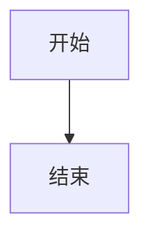

# OrangePi Zero3部署静态博客后台实现低性能的高效运用
:::tip[提示]
仅作个人想法，不保证安全性，请做好数据备份！
:::

.png)

# halei0v0-a 博客与后台使用教程

本文章介绍博客（https://blog.halei0v0.ccwu.cc/）与定制后台的架构、日常使用和运维方法。

## 一、项目总览

整个项目由两部分组成：

- 博客本体：GitHub 仓库 `halei0v0-a/halei0v0-a`，Astro 静态站点，包含文章、数据、功能组件。推送到 GitHub 后由 EdgeOne Pages 自动构建部署。
- 定制后台：`admin/` 目录下的自研管理面板（Node.js 服务），跑在 Orange Pi Zero 3 板子上，提供文章编辑、内容配置、提交推送、撤销等功能。后台只操作仓库工作区，定制代码不提交到 GitHub。

发布链路：

```
后台编辑文章 → 保存（写入板子工作区） → 提交并推送（git push main）
→ GitHub → EdgeOne Pages 自动构建 → 约 5 分钟后博客更新
```

关键事实：

- 板子：Orange Pi Zero 3，IP 192.168.1.232，后台端口 4830
- 后台地址（内网端口）4830
- 后台地址（公网，可选）：example.com（Cloudflare 隧道，需在面板配置）
- 博客地址：https://blog.halei0v0.ccwu.cc/
- Node 版本：板子 Node v22.21.1（/usr/local/bin/node）

## 二、日常写作流程

1. 打开后台并登录（密码保存在 `admin/.admin-password`，登录前可随时修改此文件，无需重启）。
2. 进入「文章管理」，点「新建文章」填标题，或点已有文章的「编辑」。
3. 左侧「模块」面板可快速插入提示框、GitHub 卡片、图表、模板等；工具栏可切换 编辑/分屏/预览 视图、配置 Front Matter、查找替换、导入导出。
4. 点「保存文章」。保存会写入板子工作区，并把原文件自动备份。
5. 进入「提交部署」，点「提交并推送」。后台只提交 `src` 和 `functions` 两个目录，其他文件（包括定制后台本身）永不入库。
6. 等待 Actions/Pages 构建，约 5 分钟后访问博客确认效果。
7. 如果发现推错了，在「提交历史」里找到那条记录，点「撤销」，后台会生成反向提交并推送。

## 三、文章语法

编辑器预览与博客渲染一致，支持以下语法：

### 基础 Markdown

标题、加粗、列表、引用、代码块、表格、链接、图片、分割线等，与常见 Markdown 相同。

### 提示框（Admonition）

博客用 remark-directive 实现，支持五种类型：

```
:::tip
技巧和建议内容。
:::

:::note
提示信息内容。
:::

:::important
重要信息内容。
:::

:::warning
警告内容。
:::

:::caution
注意事项内容。
:::
```

带自定义标题：

```
:::tip[自定义标题]
提示框内容。
:::
```

嵌套时外层用四个冒号（内层三个）：

```
::::tip
:::warning
内层警告
:::
::::
```

### GitHub 卡片

一行指令即可插入仓库卡片，卡片会显示头像、描述、stars、forks、license：

```
::github{repo="owner/name"}
```

在编辑器里点「模块 → GitHub 卡片」会弹出输入框，支持直接粘贴完整仓库链接（自动解析出 owner/repo），插入后预览立即显示真实卡片。

### GitHub Alert 引用

`> [!NOTE]` 开头的引用会自动转成提示框：

```
> [!NOTE]
> 引用内容
```

类型：NOTE、TIP、IMPORTANT、WARNING、CAUTION。

### Mermaid 图表

````

````

### 数学公式

行内公式 `$E = mc^2$`，块级公式：

```
$$
\int_{-\infty}^{\infty} e^{-x^2} dx = \sqrt{\pi}
$$
```

### 摘要分隔

```
<!--more-->
```

在列表页截断正文。

### Front Matter 字段

文章开头 `---` 之间的配置，后台有可视化弹窗（Front Matter 按钮）可编辑：

| 字段                                | 说明                      |
| ----------------------------------- | ------------------------- |
| title                               | 标题                      |
| published                           | 发布日期                  |
| updated                             | 更新日期                  |
| description                         | 摘要                      |
| image                               | 封面图（如 ./cover.webp） |
| tags                                | 标签数组                  |
| category                            | 分类                      |
| draft                               | true 为草稿不发布         |
| pinned / priority                   | 置顶与排序                |
| comment                             | 是否允许评论              |
| encrypted / password / passwordHint | 加密文章                  |
| alias / permalink                   | 自定义链接                |
| licenseName / licenseUrl            | 许可证                    |

## 四、后台功能详解

### 登录

- 密码来源：环境变量 `ADMIN_PASSWORD` 优先，否则每次登录实时读取文件（改文件即时生效）。
- 会话：HttpOnly Cookie，12 小时有效。
- 防爆破：同一 IP 连续 5 次失败锁定 1 分钟。

### 首页

- 站点运行天数、数据条目数、开关数、推送分支等状态。
- 提交历史（最近 10 条）：状态、commit hash、记录名、耗时、变更文件列表；成功的记录带「撤销」按钮。
- 博客链接入口。

### 文章管理

- 列表支持搜索（标题/分类/标签）、草稿与置顶标记。
- 编辑器：编辑/分屏/预览三种视图；字符/词数/行数统计；Tab 缩进、括号配对；Ctrl+B 加粗、Ctrl+I 斜体、Ctrl+S 保存、Ctrl+F 查找替换、Ctrl+K 链接。
- 删除文章会把整篇（含图片等附件）备份后移除，可从备份恢复。
- 导入支持 .md/.txt/.markdown/.html，导出为 Markdown 文件。

### 内容配置

- 内容配置页：搜索并修改博客的配置项，保存自动备份原文件。
- 开关管理：控制博客功能开关（如日记、音乐等）。
- 数据管理：维护 `src/data` 下的数据文件（diary、music 等），支持增删与备份。
- AI 回复：编辑 `functions/api/ai-reply-config.js`，需 push 后生效。
- 音乐上传。

### 备份与还原

保存任何文件前都会先备份原文件；删除的文章也会整体备份。备份管理页可查看、还原、删除备份。

### 提交推送

- 白名单机制：`git add src functions`，只提交内容目录。定制后台（admin/）永远以未提交状态留在工作区，不会出现在 GitHub 上。
- 无新改动但有未推送提交时，会继续推送积压的 commit。
- 提交信息自动生成：`chore: 后台内容更新 年月日 时:分:秒`。
- 失败会记录完整 git 输出，便于排查。

### 撤销提交

- 对历史中任意成功记录点「撤销」，执行 `git revert` 生成反向提交并推送。
- 冲突时自动 `git revert --abort` 回滚，不会留下半成品。
- 撤销记录也会写入历史（标记「已撤销」，记录名形如「撤销 chore: 后台内容更新 …」）。

## 五、部署架构（运维参考）

### 板子部署

1. 系统：Orange Pi Zero 3（ARM64），用户 orangepi。
2. Node：v22.21.1，从 nodejs.org 官方 tarball 安装到 /usr/local。
3. 仓库：克隆，定制 admin 文件（index.html、server.mjs、start-admin.bat、.gitignore 自定义段）为未提交状态。
4. systemd 服务：

```
[Unit]
Description=Blog Admin Panel (halei0v0-a)
After=network.target

[Service]
Type=simple
WorkingDirectory=/opt/halei0v0-a
ExecStart=/usr/local/bin/node /opt/halei0v0-a/admin/server.mjs
Restart=always
RestartSec=3

[Install]
WantedBy=multi-user.target
```

常用命令：

```
systemctl status blog-admin
systemctl restart blog-admin
journalctl -u blog-admin -n 50
```

### GitHub 集成

- 板子用 SSH 推送：`/root/.ssh/id_ed25519_github` 私钥，公钥已添加为仓库 Deploy Key（允许写）。
- `/root/.ssh/config`：

```
Host github.com
  HostName github.com
  User git
  IdentityFile /root/.ssh/id_ed25519_github
  IdentitiesOnly yes
```

- 验证：`ssh -T git@github.com` 应返回认证成功。
- git 身份为仓库级配置（user.name=halei0v0-a、user.email=halei0v0-a@users.noreply.github.com）。

### 博客部署

- EdgeOne Pages 连接 GitHub 仓库，监听 main 分支 push 自动构建。
- 构建输出 dist 目录，push 后约 5 分钟生效。
- 仓库内 .github/workflows/deploy.yml 是原版模板自带的 GitHub Pages 部署（pages 分支），日常以 EdgeOne Pages 为准。

### 公网访问（可选）

后台默认只在内网。如需公网访问：

1. Cloudflare Zero Trust 面板创建隧道（token 模式），在板子安装 cloudflared 并配置 token。
2. 添加公网 hostname（如 example.com）指向 http://localhost:4830。
3. 建议为该 hostname 配置 Access 策略（邮箱 OTP 或 GitHub 登录），给密码之外再加一道门。

直接暴露 4830 端口到公网不可取：HTTP 明文会泄露密码，且单密码防护有限。

## 六、常见问题

### 密码忘了

登录前编辑板子上的 `admin/.admin-password`（root 权限）：

```
sudo nano /路径/项目名/admin/密码文件
```

写入新密码保存，立即生效，无需重启。

### push 失败

- 看「提交并推送」的日志输出。常见原因：
  - SSH 密钥失效：`ssh -T git@github.com` 验证，检查 Deploy Key 是否被删除。
  - 远程地址不对：应为 `git@github.com:halei0v0-a/halei0v0-a.git`。
- 本机（Windows）没有 GitHub 凭据，push 必然失败，这是预期的；板子上推送正常。

### 撤销报冲突

两条提交改到同一处内容时会冲突。后台会自动中止撤销并回滚，工作区保持原样，不会破坏仓库。手动处理需要在板子上操作 git。

### 构建没更新

- EdgeOne Pages 构建约需 5 分钟，稍等再看。
- 确认推送真的成功（提交历史里「提交成功」且 hash 存在）。
- 检查 EdgeOne Pages 面板的构建日志。

### 板子重启后后台没了

systemd 已启用开机自启，重启后自动恢复。确认：

```
systemctl is-enabled blog-admin
```

### 想在本机跑后台

Windows 下双击 `admin/start-admin.bat`（密码从 admin/.admin-password 读取），访问 http://127.0.0.1:4830。注意本机仓库是原版 + 未提交定制文件的组合，不要在本机 push。

## 七、文件与目录清单

```
admin/
  server.mjs         后台服务（API、鉴权、提交推送、撤销）
  index.html         后台页面（文章编辑器、预览、模块面板）
  start-admin.bat    本机启动脚本
  .admin-password    登录密码（不入库）
  push-history.json  提交历史（不入库）
  backups/           本地备份（不入库）
vendor/              marked / highlight 本地库
src/                 博客源码（后台提交的内容目录）
  content/posts/     文章，postN【标题】/index.md
  data/              数据文件
  config.ts          站点配置
functions/           云端函数（后台提交的内容目录）
```

原则：`src` 和 `functions` 是内容，会提交；`admin/` 是工具，永不提交。改后台代码后，把文件复制到板子 `/路径/仓库名/admin/` 并 `systemctl restart blog-admin` 即可。
:::warning[警告]
安装此后台表明已知数据丢失风险，本项目不对任何数据丢失和构建问题负责！
:::


